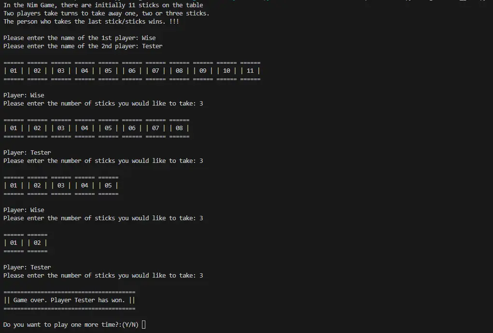
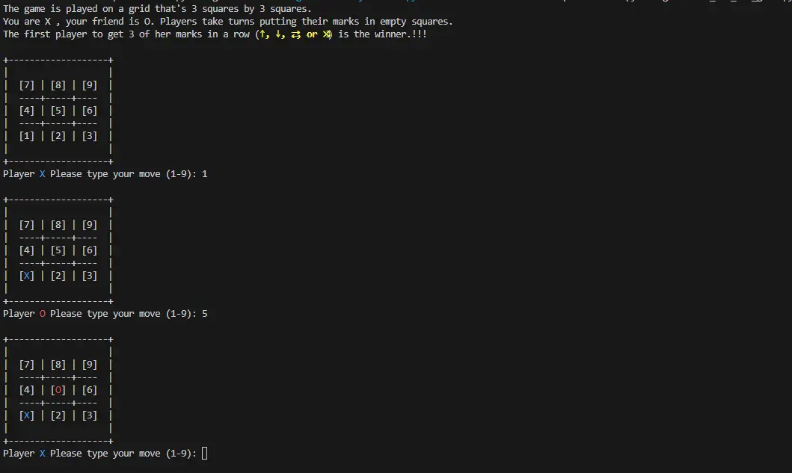
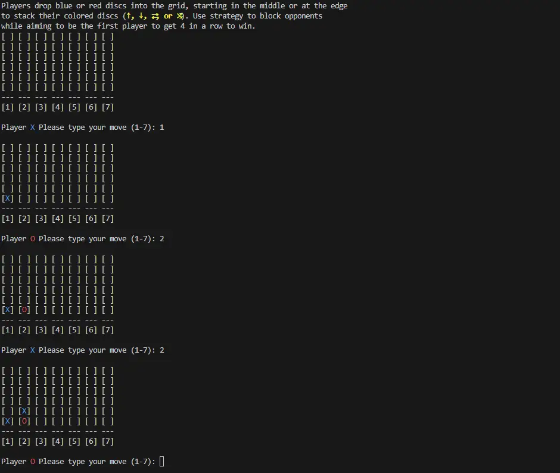

[![Contributors][contributors-shield]][contributors-url]
[![Forks][forks-shield]][forks-url]
[![Issues][issues-shield]][issues-url]
[![MIT License][license-shield]][license-url]
[![Mastodon][mastodon-shield]][mastodon-url]

[](https://github.com/marketplace/actions/super-linter)

# Python Games
Collection of some starter python game projects for beginners

## How to play these games

1. Clone this repository

```bash
git clone https://github.com/wiseweb-works/python-games.git
cd python-games
```

2. Install requirements (if has)

```bash
pip install -r requirements.txt
```

3. Start Game

```bash
python3 game-name.py
```

### Dependencies

```
Package        Version
-------------- ---------
pip            X
setuptools     X
```
## About Games

There are a total of 3 games in this repository, all of them are beginner lever that will help you practice your python basics like `loops`, `if-else`, `function`, `recursion`, `list comprehension`, `random module`, `time module`, and much more.

### 1. Nim Game


Nim is a mathematical game of strategy in which two players take turns removing (or "nimming") sticks from distinct piles. On each turn, a player must remove at least one stick, and may remove maximum of three sticks. Depending on the version being played, the goal of the game is either to avoid taking the last object or to take the last object.

### 2. Tic-Tac-Toe Game


Tic-tac-toe, noughts and crosses, or Xs and Os is a paper-and-pencil game for two players who take turns marking the spaces in a three-by-three grid with X or O. The player who succeeds in placing three of their marks in a horizontal, vertical, or diagonal row is the winner. It is a solved game, with a forced draw assuming best play from both players.

### 2. Connect4 Game


The Connect 4 game is a classic strategy game in which 2 players go head-to-head in a battle to own the grid!

Players choose blue or red discs. They drop the discs into the grid, starting in the middle or at the edge to stack their colored discs upwards, horizontally, or diagonally. Use strategy to block opponents while aiming to be the first player to get 4 in a row to win. The Connect 4 game is a great choice for a play date, a rainy day activity, or anytime your kids want a fun game to play with a friend. It's fun to go 4 the win!

## Contributing

Contributions are what make the open source community such an amazing place to learn, inspire, and create. Any contributions you make are **greatly appreciated**.

If you have a suggestion that would make this better, please fork the repo and create a pull request. You can also simply open an issue with the tag "enhancement".
Don't forget to give the project a star! Thanks again!

1. Fork the Project
2. Create your Branch (`git checkout -b game/yourname`)
3. Commit your Changes (`git commit -m 'Your comment'`)
4. Push to the Branch (`git push origin game/yourname`)
5. Open a Pull Request

## License

Distributed under the MIT License. See `LICENSE` for more information.

## Contact
Wise - [@wise](https://fosstodon.org/@wise) - wisewebworks@outlook.com

Project Link: [https://github.com/wiseweb-works/python-games](https://github.com/wiseweb-works/python-games)

[contributors-shield]: https://img.shields.io/github/contributors/wiseweb-works/python-games.svg?style=for-the-badge
[contributors-url]: https://github.com/wiseweb-works/python-games/graphs/contributors
[forks-shield]: https://img.shields.io/github/forks/wiseweb-works/python-games.svg?style=for-the-badge
[forks-url]: https://github.com/wiseweb-works/python-games/network/members
[issues-shield]: https://img.shields.io/github/issues/wiseweb-works/python-games.svg?style=for-the-badge
[issues-url]: https://github.com/wiseweb-works/python-games/issues
[license-shield]: https://img.shields.io/github/license/wiseweb-works/python-games.svg?style=for-the-badge
[license-url]: https://github.com/wiseweb-works/python-games/blob/master/LICENSE.txt
[mastodon-shield]: https://img.shields.io/badge/-mastodon-black.svg?style=for-the-badge&logo=mastodon&colorB=555
[mastodon-url]: https://fosstodon.org/@wise
